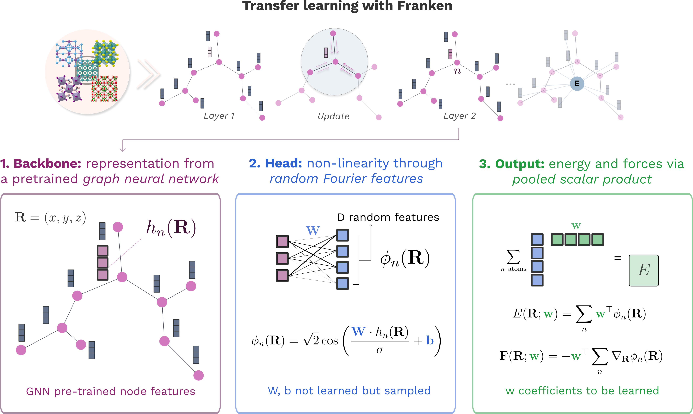

.. role:: frnkword

Franken: A Method for Efficient and Accurate Molecular Dynamics
================================================================

:tt:`franken` is a novel method designed to enhance the accuracy of atomistic foundation models used for molecular dynamics simulations, all while maintaining computational efficiency. This method builds upon the capabilities of the `MEKRR method <https://proceedings.neurips.cc/paper_files/paper/2023/hash/5f02c76bc411a6f7c9a8bb2cbf981260-Abstract-Conference.html>`_, extending its application from fitting energies to also fitting forces, thereby enabling feasible molecular dynamics (MD) simulations.

Franken's Three-Step Process
----------------------------

:tt:`franken` operates through a three-step pipeline:

#. **Feature Extraction:** The initial step involves representing the chemical environment of each atom within a
   molecular configuration using features extracted from a pre-trained GNN foundation model.
   This leverages the inherent knowledge captured by these pre-trained models.
   Specifically, :tt:`franken` utilizes features derived from models such as the `MACE-MP0 <https://arxiv.org/abs/2401.00096>`_ model.

#. **Random Features Enhancement:** In this stage, :tt:`franken` introduces non-linearity into the model by transforming the
   extracted GNN features using Random Features (RF) maps. These RF maps offer a computationally efficient alternative
   to traditional kernel methods by approximating kernel functions, including the widely used Gaussian kernel,
   utilizing randomly sampled parameters.

#. **Energy and Force Prediction:** The final step involves predicting atomic energies and forces by employing a readout mechanism.
   This mechanism leverages a learnable vector of coefficients in conjunction with the transformed features obtained from the preceding step.
   This design takes advantage of the efficient optimization characteristics of RF models.

   The three-step pipeline at the heart of :tt:`franken`.

Advantages of Franken
---------------------

:tt:`franken` presents several distinct advantages that position it as a valuable asset in the realm of molecular dynamics simulations:

- **Closed-Form Optimization:** :tt:`franken` offers the significant advantage of determining the globally optimal model
  parameters through a closed-form solution. This eliminates the reliance on iterative gradient descent, leading to
  substantial reductions in training time and ensuring efficient optimization.

- **High Sample Efficiency:** One of :tt:`franken`'s hallmarks is its exceptional data efficiency.
  The method achieves accurate results even with a limited number of training samples,
  as evidenced by experiments on the TM23 dataset. Notably, :tt:`franken` attained a validation error
  of 9 meV/ using only 128 samples with 1024 random features, underscoring its ability to extract
  valuable information from relatively small datasets.

    .. figure:: _static/TM23Cu_sample_complexity.png
        :class: rounded-image
        :width: 75%
        :align: center

   Sample complexity of :tt:`franken` on the :tt:`Cu` data from the `TM23 Dataset <https://www.nature.com/articles/s41524-024-01264-z>`_. (MACE-MP0 Backbone)

- **Parallelization Capabilities:**  :tt:`franken`'s training algorithm inherently lends itself to parallelization, allowing it to be scaled across multiple GPUs, thereby significantly accelerating training. This scalability becomes crucial when addressing the computational burden posed by simulations of increasingly intricate molecular systems.

.. toctree::
   :maxdepth: 2
   :caption: HOW TOs:
   :hidden:

   Introduction <self>

   topics/installation.md
   topics/model_registry.md
   topics/autotune.md
   topics/sample_complexity.md
   topics/lammps.md

.. toctree::
   :maxdepth: 3
   :caption: API Reference:
   :hidden:

   reference/index
   reference/cli